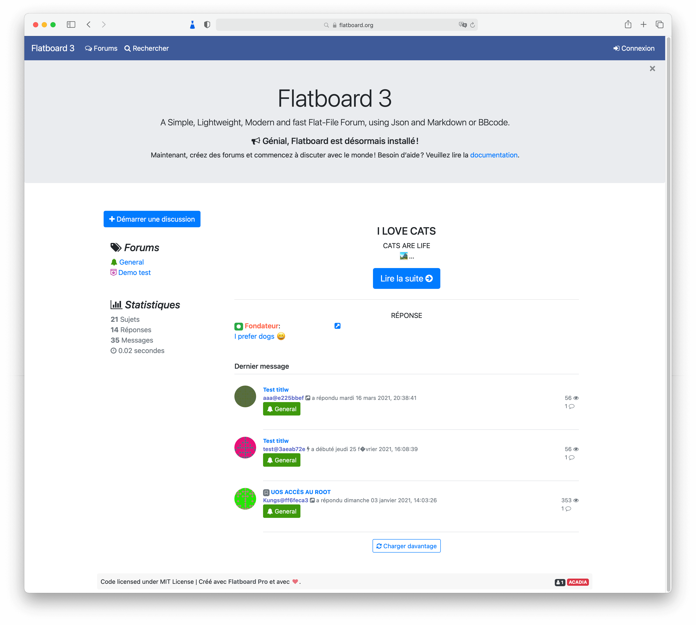

Flatboard  
===================

Fast and lightweight flat-file forum software, Json powered.
We're just getting started, so if you have any questions, comments, bugs to report or enhancements that should be implemented, please do feel free to post those here on GitHub.  
Online demo/support: http://flatboard.free.fr

## Getting Started
- [Installation](#installation)
- [License](#license)

## REQUIREMENTS

#### System requirements
Make sure your server meets the following requirements.

- Webserver (Apache)
- PHP 5.6 or higher

#### PHP extensions
Flatboard needs the following PHP extensions to be enabled:

- PHP [mbstring](http://php.net/manual/en/book.mbstring.php) module for full UTF-8 support.
- PHP [gd](http://php.net/manual/en/book.image.php) module for image processing.
- PHP [json](https://php.net/manual/en/book.json.php) module for JSON manipulation.

## Installation
1. Download the latest version from [flatboard.free.fr](http://flatboard.free.fr/download.php?file=flatboard_latest.zip)
2. Extract the archive.
3. Upload `flatboard.zip` and `index.php` to your server/hosting.
4. Visit your domain http://domain.com/flatboard
5. Follow the Flatboard Unpack & the Installer to configure your website.

## License
See [LICENSE](https://github.com/Fred89/flatboard/blob/master/LICENSE)
